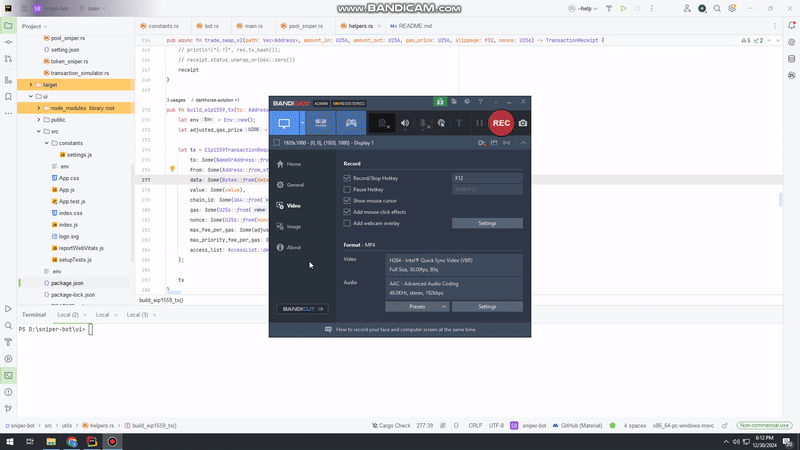

# PulseChain Sniper Bot

This is a PulseChain Sniper Bot that supports two main functionalities: **Direct Swap** and **Snipe**. The bot consists of a Rust backend and a React frontend.

---

## Features
### **Direct Swap**
- Swap tokens by entering:
  - Target token address (e.g., `0x...`)
  - Payment token (`PLS` or `HEX`)
  - Priority fee and slippage
  - Swap amount (fixed or custom, must be positive)
- One-click swapping with queuing on the transaction board.
- Alerts for swapping status.

### **Snipe**
- Set up as in Direct Swap.
- Start sniping with the "Snipe Start" button.
  - Displays spinning animation during sniping.
- Automatic swapping after successful snipe.
- Statuses: `New`, `Pending`, `Swapped`, or `Failed`.
- Auto-retries on failures until successful.
- Stop sniping by killing the server in the terminal.

---

## Setup and Usage

### Step 1: Environment Variables
Set the following environment variables in your `.env` file:
```env
RPC_URL=http://rpc.pulsechain.com
WSS_URL=wss://rpc.pulsechain.com
CHAIN_ID=369
PRIVATE_KEY=Replace Your private key
PUBLIC_KEY=Replace Your public key
```

### Step 2: Start the Backend
Run the server:
```bash
cargo run src/main.rs
```

### Step 3: Start the Frontend
1. Navigate to the `ui` directory:
   ```bash
   cd ui
   ```
2. Start the React development server:
   ```bash
   npm start
   ```
3. Open the application in your browser at `http://localhost:3000`.

---

## Usage Guide
### Direct Swap
1. Input:
   - Target token address.
   - Select payment token (`PLS` or `HEX`).
   - Set priority fee, slippage, and swap amount.
2. Swap by clicking the swap button (repeatable).
3. Monitor transactions on the "Queued Transaction Board."

#### Example Screenshot



### Snipe
1. Same inputs as Direct Swap.
2. Click "Snipe Start."
3. Monitor snipe status:
   - `New`, `Pending`, `Swapped`, or `Failed`.
   - Retries automatically on failure.
4. Stop sniping by killing the backend server and restarting it.

---

### Notes
- Restart the backend to resume the bot after stopping sniping.
- The UI can be refreshed without restarting the frontend.

---

## Project Structure

### Backend
```
backend/
├── src/                # Source code for Rust backend
├── Cargo.toml          # Rust package configuration
├── README.md           # This file
```

### Frontend (UI)
```
ui/
├── public/                   # Static assets
│   ├── images/               # Contains images for README and UI
│   └── index.html            # Main HTML template
├── src/                      # React application source code
│   ├── assets/               # Styles, icons, or other assets
│   ├── components/           # Reusable UI components
│   ├── pages/                # Page-level components
│   ├── App.js                # Main App component
│   └── index.js              # Application entry point
├── package.json              # React dependencies and scripts
└── README.md                 # Documentation
```

---

## Contributing

Feel free to fork the repository, create branches, and submit pull requests. Contributions are welcome!

---

## License

This project is licensed under the [MIT License](LICENSE).

---

## Contact

For further inquiries, please reach out to the project maintainer.
